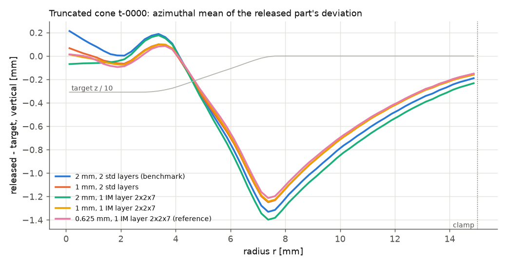
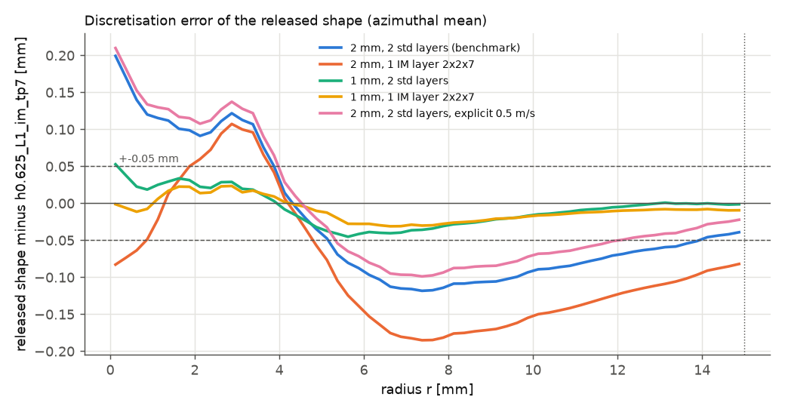

# Physics audit, lens: numerical convergence

**Question.** Is the discretisation of the springback benchmark
(`benchmarks/springback/config.json`: 20 x 20 x 2 standard Hex8 with mean
dilatation, 2 mm in plane, 0.5 mm layers, 2 x 2 x 2 points, `finite_logarithmic`,
1 mm tool travel per increment, penalty scale 10, implicit) converged for the
quantities the benchmark uses - the released shape, its deviation from the
target (RMS / max), the rim sag and the springback? If not, what is the
cheapest setup whose discretisation error on the final shape is below about
0.05 mm, and what does it cost?

**Scope.** This is a *numerical* check: how far the benchmark's answer is from
the answer the *same model* (same material data, fixture, tool path, release)
gives on a converged discretisation. It says nothing about how far that model
is from a real RoboForming part - that is the other lenses' business - and a
converged wrong model is still wrong.

## Bottom line

* **No, the benchmark discretisation is not converged.** On the
  representative part (truncated cone t-0000, wall 38.6 deg) its released
  shape is 0.10-0.12 mm RMS and up to 0.24 mm (worst point) away from the
  converged answer of the *same* model. It overstates the RMS deviation from
  target by 0.085-0.107 mm (0.767 against a Richardson limit of 0.66-0.68 mm,
  +14 %), the largest deviation by 0.19-0.24 mm and the rim sag by
  0.12-0.15 mm (-1.151 against -1.00 to -1.03 mm), and puts the untouched
  floor 0.20 mm too high. A **second test part** (truncated cone t-0001,
  wall 54 deg, added on resume) shows the same picture: 0.080 mm RMS /
  0.256 mm max from its finest mesh, RMS deviation +0.06 mm, max +0.11-0.18,
  rim sag 0.09 mm too much sag (Table 5). The springback itself
  (0.12-0.17 mm) is converged to 0.015-0.021 mm RMS; the error is in the
  formed shape.
* **The in-plane element size is the parameter that matters** (observed
  order ~2 between 2 and 0.625 mm, but 1.3-6 depending on the mesh triple:
  the convergence is not cleanly asymptotic, so every error below is quoted
  as a band over 6-12 Richardson estimates, `richardson_fit*.csv`). Layers
  (2 -> 4 standard, 1 -> 2 IM), points through the thickness (5 -> 7), tool
  travel (1 -> 0.5 mm), penalty (10 -> 30), Newton tolerance (1e-6 -> 1e-8)
  and release increments (10 -> 40) each change the released shape by
  <= 0.008 mm RMS, <= 0.027 mm max; penalty 3 instead of 10 by 0.005-0.009 mm
  RMS / 0.014-0.021 mm max. The 2 mm standard Hex8 is close only through a
  cancellation between bending locking and the coarse mesh (the locking-free
  element at 2 mm is *worse*, 0.11-0.15 mm).
* **The rim sag is physical in this model**: refinement reduces it by
  8-12 % (to ~1.02-1.03 mm on both parts), so the benchmark's conclusion
  that the rim band dominates survives.
* **Cheapest setup below 0.05 mm on the final shape:** 0.833 mm in plane
  (48 x 48), one incompatible-mode (IM) layer, 2 x 2 x 5 points, penalty 10:
  released-shape field error 0.021-0.033 mm RMS, error of the RMS deviation
  +0.011..+0.038, of the rim sag -0.016..-0.055, of the worst-point deviation
  +0.011..+0.080 mm (both parts; central estimates +0.015-0.023 / -0.027 to
  -0.031 / +0.031-0.036). 1 586-1 965 s per run on one thread
  (7-11 times the benchmark). It meets 0.05 mm on the RMS and the field
  with margin, on the rim sag and the worst point only on the central
  estimates; 0.625 mm (3 924-4 441 s, 20-22 times) is needed to bound the
  worst point near 0.05 mm with the pessimistic estimates. Penalty 3 halves
  the cost (798-1 172 s) for +0.005-0.009 mm.
* **Explicit is not the route here:** 0.017-0.019 mm from implicit on the
  final shape but 13-20 % less springback (the deficit grows with
  refinement), 1.5-2.8 times the implicit cost on these sheets, and no fast
  kernel for the incompatible-mode element.

## What was run

**Part.** `truncated_cone-s2026-0000`, a test part of the benchmark
(`benchmarks/springback/stage_n18/design.csv`): top radius 7.32 mm, depth
3.09 mm, wall 38.6 deg, top fillet 1.08 mm, bottom fillet 2.08 mm, footprint
15.4 mm; formed as commanded (the "uncompensated" run). The commanded height
map is the benchmark's own (`commanded.npz` of run-cache entry
`3c6e05ba...`, see `cases.py`). Its benchmark result: vertical RMS 0.767 mm
(`stage_n18/headline.csv`, 0.7665).

**Decks.** `run_case.py` writes each deck with precomp's own `FormingSetup` /
`build_deck` from the benchmark's `solver.setup`, then patches the keys
`FormingSetup` does not expose (`model.element_formulation`,
`model.integration.thickness_points`, `forming.newton`, release increments,
a `form_explicit` step). The rebuilt benchmark deck is identical to the cached
one (`diff` of the canonical JSON, and the tool path byte for byte), and this
build (`sparlab 1.0.0 (b1a81217b6e3-dirty)`, `build/`) reproduces the cached
result **bit for bit** (`diffs.csv`: `bench_cache` vs `h2_L2_std`, 0.0000 mm
everywhere). All runs: one thread, `OPENBLAS_NUM_THREADS=1`, at most two at a
time on the shared 4-core machine (load average 2-9; each run's load is in
its `run.json` and in Table 1, so wall times are indicative to +-50 %).

**Cases** (`cases.py`; name = `h<in-plane mm>_L<layers>_<std|im>[_tp<points>][_variant]`):
standard Hex8 (mean dilatation) or Hex8 with incompatible modes (IM, Wilson-
Taylor, no mean dilatation); `tp` = Gauss points through each layer (default
2); in-plane 2, 1, 0.833, 0.625 mm (every size divides the 40 mm blank and
the 5 mm clamp exactly, so the clamp edge and the 3-2-1 supports do not move;
0.5 mm IM was started and aborted - 3.4 s per Newton iteration, projected
3.3-4.7 h, `cases/h0.5_L1_im_tp7/ABORTED`); tool travel 1 / 0.5 mm; penalty
3 / 10 / 30; Newton tolerances 1e-6 / 1e-8; release increments 10 / 40;
explicit central differences at 0.5 m/s with selective dynamic mass scaling
to 1 us (equivalent speed v sqrt(s) = 7.5-9 m/s, the regime docs/forming.md
7.3 recommends for springback), handed to the same implicit unload / release.

**Metrics** (`analyze.py`, on the target's 0.25 mm grid exactly as
`springback_benchmark.py`): vertical deviation of the released part from the
target over the part (RMS, max, bias; normal RMS); the benchmark's regions -
the *rim sag* is the bias over the upper band (part less than 1 mm deep, as
`regions.csv`), the deeper part, the flange and the free flange ring;
*springback* = released minus formed surface (tool still on the part,
"sb_tot"), and released minus unloaded (the unclamping alone, "sb_rel");
the formed shape; pairwise differences of the released, formed and springback
fields between cases (RMS and max over the part: `diffs.csv`); azimuthal
profiles (`profiles.csv`). The reference is the finest mesh,
`h0.625_L1_im_tp7`; its own remaining error comes from Richardson
extrapolation (`richardson.py`).

## Results

### Table 1 - every case (truncated_cone-s2026-0000, released part vs target) [mm]

| Case | DOFs | vert. RMS | vert. max | rim sag (upper-band bias) | deep-part bias | springback RMS (release - form) | springback max | formed depth | released vs reference RMS / max | wall [s] (load) |
|---|--:|--:|--:|--:|--:|--:|--:|--:|--:|--:|
| 2 mm, 2 std layers (**benchmark**) | 3969 | 0.767 | 1.426 | -1.151 | -0.188 | 0.120 | 0.139 | 3.082 | 0.099 / 0.242 | 215 (2.8-6.8) |
| 2 mm, 4 std layers | 6615 | 0.768 | 1.426 | -1.153 | -0.189 | 0.119 | 0.138 | 3.081 | 0.100 / 0.248 | 630 (8.7-5.7) |
| 2 mm, 2 IM layers 2x2x2 | 3969 | 0.803 | 1.458 | -1.206 | -0.217 | 0.142 | 0.169 | 3.084 | 0.125 / 0.246 | 392 (5.6-8.7) |
| 2 mm, 1 IM layer 2x2x5 | 2646 | 0.811 | 1.469 | -1.218 | -0.222 | 0.143 | 0.173 | 3.084 | 0.132 / 0.257 | 249 (6.8-5.6) |
| 2 mm, 1 IM layer 2x2x7 | 2646 | 0.809 | 1.466 | -1.215 | -0.221 | 0.142 | 0.172 | 3.084 | 0.130 / 0.254 | 308 (4.1-4.0) |
| 2 mm, 2 std layers 2x2x5 | 3969 | 0.767 | 1.423 | -1.152 | -0.189 | 0.122 | 0.141 | 3.082 | 0.099 / 0.242 | 308 (4.1-4.1) |
| 2 mm, 2 std, travel 0.5 mm | 3969 | 0.767 | 1.424 | -1.151 | -0.189 | 0.118 | 0.138 | 3.082 | 0.099 / 0.245 | 154 (4.0-3.5) |
| 2 mm, 2 std, penalty 30 | 3969 | 0.767 | 1.424 | -1.151 | -0.188 | 0.117 | 0.137 | 3.081 | 0.099 / 0.245 | 221 (3.5-3.0) |
| 2 mm, 2 std, penalty 3 | 3969 | 0.768 | 1.418 | -1.153 | -0.188 | 0.121 | 0.140 | 3.081 | 0.099 / 0.246 | 77 (3.6-3.2) |
| 2 mm, 2 std, Newton tol 1e-8 | 3969 | 0.767 | 1.423 | -1.152 | -0.190 | 0.122 | 0.140 | 3.082 | 0.098 / 0.240 | 138 (4.0-4.0) |
| 2 mm, 2 std, 40 release increments | 3969 | 0.767 | 1.426 | -1.151 | -0.188 | 0.120 | 0.139 | 3.082 | 0.099 / 0.242 | 161 (4.1-4.1) |
| 2 mm, 2 std, explicit 0.5 m/s | 3969 | 0.754 | 1.405 | -1.133 | -0.173 | 0.105 | 0.125 | 3.079 | 0.093 / 0.257 | 604 (3.0-2.1) |
| 1 mm, 2 std layers | 15129 | 0.716 | 1.280 | -1.076 | -0.212 | 0.135 | 0.157 | 3.094 | 0.035 / 0.083 | 1601 (2.8-5.2) |
| 1 mm, 2 std, explicit 0.5 m/s | 15129 | 0.703 | 1.261 | -1.059 | -0.196 | 0.113 | 0.130 | 3.100 | 0.028 / 0.082 | 2463 (3.2-4.2) |
| 1 mm, 1 IM layer 2x2x5 | 10086 | 0.710 | 1.273 | -1.071 | -0.206 | 0.137 | 0.165 | 3.093 | 0.027 / 0.065 | 1030 (2.1-3.2) |
| 1 mm, 1 IM layer 2x2x7 | 10086 | 0.708 | 1.274 | -1.069 | -0.204 | 0.137 | 0.164 | 3.094 | 0.025 / 0.061 | 1589 (5.2-4.1) |
| 1 mm, 2 IM layers 2x2x3 | 15129 | 0.711 | 1.269 | -1.071 | -0.211 | 0.140 | 0.164 | 3.100 | 0.028 / 0.067 | 1668 (4.1-3.6) |
| 0.833 mm, 1 IM layer 2x2x5 | 14406 | 0.698 | 1.250 | -1.052 | -0.204 | 0.132 | 0.158 | 3.109 | 0.014 / 0.050 | 1586 (4.3-4.0) |
| 0.833 mm, 1 IM layer 2x2x5, penalty 3 | 14406 | 0.706 | 1.265 | -1.065 | -0.208 | 0.136 | 0.162 | 3.106 | 0.021 / 0.052 | 798 (2.8-2.0) |
| 0.714 mm, 1 IM layer 2x2x5 | 19494 | 0.691 | 1.243 | -1.043 | -0.202 | 0.130 | 0.156 | 3.107 | 0.008 / 0.036 | 2443 (4.0-4.2) |
| 0.714 mm, 1 IM layer 2x2x5, penalty 3 | 19494 | 0.698 | 1.253 | -1.054 | -0.205 | 0.133 | 0.159 | 3.102 | 0.013 / 0.037 | 1448 (1.0-4.0) |
| 0.625 mm, 1 IM layer 2x2x7 (**reference**) | 25350 | 0.688 | 1.236 | -1.038 | -0.202 | 0.131 | 0.157 | 3.108 | 0 (reference) | 4441 (5.0-3.1) |
| 0.625 mm, 2 std, explicit 0.5 m/s | 38025 | 0.681 | 1.228 | -1.029 | -0.184 | 0.105 | 0.128 | 3.123 | 0.019 / 0.060 | 6617 (0.7-4.0) |

### Table 2 - one refinement at a time: change of each quantity [mm]

| Refinement (from -> to) | d vert. RMS | d vert. max | d rim sag | d springback RMS | released-shape change RMS / max | springback-field change RMS / max | formed-shape change RMS |
|---|--:|--:|--:|--:|--:|--:|--:|
| in-plane 2 -> 1 mm (2 std layers) | -0.051 | -0.147 | +0.075 | +0.015 | 0.070 / 0.236 | 0.016 / 0.026 | 0.072 |
| in-plane 2 -> 1 mm (1 IM layer 2x2x7) | -0.101 | -0.192 | +0.147 | -0.005 | 0.107 / 0.219 | 0.008 / 0.015 | 0.102 |
| in-plane 1 -> 0.833 mm (1 IM layer 2x2x5) | -0.013 | -0.023 | +0.018 | -0.005 | 0.017 / 0.055 | 0.005 / 0.008 | 0.015 |
| in-plane 1 -> 0.625 mm (1 IM layer 2x2x7) | -0.021 | -0.038 | +0.030 | -0.005 | 0.025 / 0.061 | 0.006 / 0.009 | 0.022 |
| layers 2 -> 4 (std, 2 mm) | +0.002 | -0.000 | -0.002 | -0.001 | 0.003 / 0.017 | 0.001 / 0.001 | 0.004 |
| std 2 layers -> IM 2 layers (2 mm) | +0.037 | +0.031 | -0.055 | +0.022 | 0.049 / 0.241 | 0.023 / 0.032 | 0.034 |
| std 2 layers -> IM 1 layer 2x2x5 (2 mm) | +0.045 | +0.042 | -0.067 | +0.023 | 0.058 / 0.279 | 0.024 / 0.035 | 0.042 |
| std 2 layers -> IM 1 layer 2x2x7 (1 mm) | -0.008 | -0.006 | +0.008 | +0.002 | 0.015 / 0.054 | 0.006 / 0.017 | 0.015 |
| IM 1 layer -> 2 layers 2x2x3 (1 mm) | +0.003 | -0.005 | -0.002 | +0.003 | 0.008 / 0.027 | 0.005 / 0.014 | 0.006 |
| std 2x2x2 -> 2x2x5 per layer (2 mm) | +0.001 | -0.003 | -0.001 | +0.002 | 0.002 / 0.008 | 0.003 / 0.004 | 0.002 |
| thickness points 5 -> 7 (IM, 2 mm) | -0.002 | -0.002 | +0.002 | -0.000 | 0.002 / 0.004 | 0.001 / 0.001 | 0.002 |
| thickness points 5 -> 7 (IM, 1 mm) | -0.002 | +0.001 | +0.002 | -0.000 | 0.003 / 0.025 | 0.000 / 0.001 | 0.003 |
| tool travel 1 -> 0.5 mm per increment | +0.000 | -0.003 | -0.000 | -0.002 | 0.002 / 0.012 | 0.002 / 0.004 | 0.003 |
| penalty scale 10 -> 30 | -0.000 | -0.002 | +0.000 | -0.003 | 0.002 / 0.015 | 0.003 / 0.004 | 0.004 |
| penalty scale 3 -> 10 | -0.001 | +0.008 | +0.002 | -0.001 | 0.004 / 0.023 | 0.002 / 0.004 | 0.004 |
| penalty scale 3 -> 10 (0.833 mm IM) | -0.008 | -0.015 | +0.012 | -0.004 | 0.009 / 0.021 | 0.004 / 0.005 | 0.007 |
| Newton tolerances 1e-6 -> 1e-8 | +0.001 | -0.003 | -0.001 | +0.002 | 0.003 / 0.016 | 0.002 / 0.003 | 0.003 |
| release increments 10 -> 40 | +0.000 | +0.000 | +0.000 | +0.000 | 0.000 / 0.000 | 0.000 / 0.000 | 0.000 |
| implicit -> explicit 0.5 m/s (2 mm) | -0.013 | -0.021 | +0.018 | -0.015 | 0.017 / 0.024 | 0.016 / 0.024 | 0.007 |
| implicit -> explicit 0.5 m/s (1 mm) | -0.013 | -0.019 | +0.018 | -0.022 | 0.017 / 0.023 | 0.023 / 0.031 | 0.007 |
| benchmark -> reference | -0.079 | -0.191 | +0.113 | +0.011 | 0.099 / 0.242 | 0.014 / 0.025 | 0.099 |
| 1 mm IM 2x2x5 -> reference | -0.023 | -0.037 | +0.032 | -0.006 | 0.027 / 0.065 | 0.006 / 0.009 | 0.024 |
| 0.833 mm IM 2x2x5 -> reference | -0.010 | -0.014 | +0.014 | -0.001 | 0.014 / 0.050 | 0.001 / 0.005 | 0.013 |
| 0.833 mm IM 2x2x5 penalty 3 -> reference | -0.018 | -0.029 | +0.026 | -0.005 | 0.021 / 0.052 | 0.005 / 0.008 | 0.017 |
| in-plane 0.833 -> 0.714 mm (IM 2x2x5, penalty 3) | -0.007 | -0.012 | +0.011 | -0.003 | 0.011 / 0.033 | 0.004 / 0.007 | 0.010 |
| penalty scale 3 -> 10 (0.714 mm IM) | -0.007 | -0.010 | +0.010 | -0.003 | 0.008 / 0.014 | 0.003 / 0.004 | 0.006 |
| 0.714 mm IM 2x2x5 penalty 3 -> reference | -0.011 | -0.017 | +0.015 | -0.001 | 0.013 / 0.037 | 0.002 / 0.004 | 0.012 |
| implicit -> explicit 0.5 m/s (0.625 mm; std 2 layers vs IM reference) | -0.007 | -0.008 | +0.010 | -0.027 | 0.019 / 0.060 | 0.028 / 0.037 | 0.018 |

### Table 3 - Richardson extrapolation, 1 IM layer 2x2x7, h = 2 / 1 / 0.625 mm

| Quantity | values at 2 / 1 / 0.625 mm | observed order p | extrapolated (h -> 0) | error at 2 mm | at 1 mm | at 0.625 mm |
|---|---|--:|--:|--:|--:|--:|
| vert_rms_mm | 0.8095 / 0.7084 / 0.6875 | 1.98 | 0.674 | 0.136 | 0.034 | 0.014 |
| vert_max_mm | 1.4663 / 1.2741 / 1.2358 | 2.03 | 1.212 | 0.254 | 0.062 | 0.024 |
| rim_sag_mm | -1.2154 / -1.0685 / -1.0385 | 1.99 | -1.019 | -0.196 | -0.049 | -0.019 |
| deep_bias_mm | -0.2210 / -0.2043 / -0.2021 | 2.69 | -0.201 | -0.020 | -0.003 | -0.001 |
| free_flange_bias_mm | -0.5030 / -0.4057 / -0.3933 | 2.74 | -0.389 | -0.114 | -0.017 | -0.005 |
| depth_release_mm | 3.1818 / 3.2061 / 3.2245 | - | - | - | - | - |
| sb_tot_rms_mm | 0.1422 / 0.1368 / 0.1315 | - | - | - | - | - |
| sb_rel_rms_mm | 0.1857 / 0.1644 / 0.1554 | 0.80 | 0.136 | 0.050 | 0.029 | 0.020 |
| fz_mean_N | 416.2200 / 521.6500 / 528.2000 | 3.85 | 529.480 | -113.260 | -7.829 | -1.279 |
| release field RMS diff (part) | d(h1,h2) 0.1073, d(h2,h3) 0.0250 | 1.78 | - | 0.151 | 0.044 | 0.019 |
| sb_tot field RMS diff (part) | d(h1,h2) 0.0078, d(h2,h3) 0.0055 | - | - | - | - | - |

### Table 4 - estimated discretisation error of each setup against the Richardson limit [mm]

Limits (h -> 0): vertical RMS 0.674, vertical max 1.212, rim sag -1.019. Released-shape field error = RMS difference to the reference plus the reference's own Richardson error (0.019), an upper bound (the two add when the errors have one shape, as in the IM family).

| Setup | error of vert. RMS | error of vert. max | error of rim sag | released-shape field error RMS (bound) | wall [s] (load) | cost / benchmark run |
|---|--:|--:|--:|--:|--:|--:|
| 2 mm, 2 std layers (**benchmark**) | +0.093 | +0.215 | -0.132 | 0.118 | 215 (2.8-6.8) | 1.0 |
| 2 mm, 4 std layers | +0.094 | +0.214 | -0.134 | 0.119 | 630 (8.7-5.7) | 2.9 |
| 2 mm, 2 IM layers 2x2x2 | +0.130 | +0.246 | -0.187 | 0.144 | 392 (5.6-8.7) | 1.8 |
| 2 mm, 1 IM layer 2x2x5 | +0.137 | +0.257 | -0.199 | 0.151 | 249 (6.8-5.6) | 1.2 |
| 2 mm, 1 IM layer 2x2x7 | +0.136 | +0.254 | -0.196 | 0.149 | 308 (4.1-4.0) | 1.4 |
| 2 mm, 2 std layers 2x2x5 | +0.093 | +0.211 | -0.133 | 0.118 | 308 (4.1-4.1) | 1.4 |
| 2 mm, 2 std, explicit 0.5 m/s | +0.080 | +0.193 | -0.114 | 0.112 | 604 (3.0-2.1) | 2.8 |
| 1 mm, 2 std layers | +0.042 | +0.068 | -0.057 | 0.054 | 1601 (2.8-5.2) | 7.5 |
| 1 mm, 2 std, explicit 0.5 m/s | +0.029 | +0.049 | -0.040 | 0.047 | 2463 (3.2-4.2) | 11.5 |
| 1 mm, 1 IM layer 2x2x5 | +0.036 | +0.061 | -0.052 | 0.046 | 1030 (2.1-3.2) | 4.8 |
| 1 mm, 1 IM layer 2x2x7 | +0.034 | +0.062 | -0.049 | 0.044 | 1589 (5.2-4.1) | 7.4 |
| 1 mm, 2 IM layers 2x2x3 | +0.037 | +0.057 | -0.052 | 0.047 | 1668 (4.1-3.6) | 7.8 |
| 0.833 mm, 1 IM layer 2x2x5 | +0.024 | +0.038 | -0.033 | 0.033 | 1586 (4.3-4.0) | 7.4 |
| 0.833 mm, 1 IM layer 2x2x5, penalty 3 | +0.032 | +0.053 | -0.046 | 0.040 | 798 (2.8-2.0) | 3.7 |
| 0.714 mm, 1 IM layer 2x2x5 | +0.017 | +0.031 | -0.024 | 0.027 | 2443 (4.0-4.2) | 11.4 |
| 0.714 mm, 1 IM layer 2x2x5, penalty 3 | +0.024 | +0.041 | -0.035 | 0.032 | 1448 (1.0-4.0) | 6.7 |
| 0.625 mm, 1 IM layer 2x2x7 (**reference**) | +0.014 | +0.024 | -0.019 | 0.019 | 4441 (5.0-3.1) | 20.7 |
| 0.625 mm, 2 std, explicit 0.5 m/s | +0.007 | +0.016 | -0.010 | 0.038 | 6617 (0.7-4.0) | 30.8 |

The explicit rows look better than their implicit twins only because the explicit runs' smaller springback (finding 5) happens to offset part of the mesh error on this part; that is not a reason to prefer them. Wall times were measured at different load averages (in brackets) on a shared machine and are indicative to about +-50 %.

### Table 5 - second check part truncated_cone-s2026-0001 (wall 54 deg) [mm]

Released-shape difference against `c1_h0.625_L1_im_tp5`; errors against the band of Richardson limits of `richardson_fit_c1.csv` (empty until three IM meshes exist).

| Case | vert. RMS | vert. max | rim sag | springback RMS | released vs finest RMS / max | err. RMS | err. max | err. rim sag | wall [s] (load) |
|---|--:|--:|--:|--:|--:|--:|--:|--:|--:|
| 2 mm, 2 std layers (**benchmark**) | 0.703 | 1.287 | -1.122 | 0.150 | 0.080 / 0.256 | +0.057..+0.061 | +0.111..+0.180 | -0.086..-0.096 | 178 (4.0-4.0) |
| 2 mm, 1 IM layer 2x2x5 | 0.748 | 1.365 | -1.198 | 0.167 | 0.114 / 0.208 | +0.103..+0.106 | +0.189..+0.258 | -0.162..-0.172 | 190 (4.0-4.0) |
| 1 mm, 1 IM layer 2x2x5 | 0.664 | 1.209 | -1.065 | 0.171 | 0.019 / 0.060 | +0.019..+0.023 | +0.033..+0.102 | -0.029..-0.040 | 1147 (4.2-4.0) |
| 0.833 mm, 1 IM layer 2x2x5 | 0.657 | 1.187 | -1.052 | 0.164 | 0.012 / 0.044 | +0.011..+0.015 | +0.011..+0.080 | -0.016..-0.027 | 1965 (4.0-4.2) |
| 0.833 mm, 1 IM layer 2x2x5, penalty 3 | 0.659 | 1.192 | -1.055 | 0.165 | 0.015 / 0.055 | +0.013..+0.017 | +0.016..+0.085 | -0.019..-0.030 | 1172 (4.2-4.2) |
| 0.625 mm, 1 IM layer 2x2x5 (finest) | 0.651 | 1.178 | -1.043 | 0.165 | 0 (finest) | +0.005..+0.009 | +0.002..+0.071 | -0.006..-0.017 | 3924 (3.9-3.0) |

### Table 6 - uncertainty of the Richardson limit (`richardson_fit.py`) [mm]

Every monotone triple of the IM 1-layer meshes plus least-squares fits
(p = 2 over h <= 1 mm; free p over all meshes). One end of each band comes
from triples that include the pre-asymptotic 2 mm mesh, the other from
triples of meshes <= 1 mm (the more credible). Errors are "value minus
limit" over the band.

| Part | Quantity | limit band (median) | benchmark error | 1 mm IM | 0.833 mm IM | 0.714 mm IM | 0.625 mm IM |
|---|---|---|--:|--:|--:|--:|--:|
| t-0000 (38.6 deg) | vert. RMS | 0.659 .. 0.682 (0.675) | +0.085..+0.107 | +0.029..+0.051 | +0.016..+0.038 | +0.010..+0.032 | +0.006..+0.028 |
| t-0000 (38.6 deg) | vert. max | 1.188 .. 1.238 (1.214) | +0.189..+0.239 | +0.035..+0.086 | +0.012..+0.063 | +0.005..+0.055 | -0.002..+0.048 |
| t-0000 (38.6 deg) | rim sag | -1.030 .. -0.997 (-1.021) | -0.121..-0.154 | -0.041..-0.074 | -0.022..-0.055 | -0.013..-0.046 | -0.008..-0.042 |
| t-0001 (54.0 deg) | vert. RMS | 0.642 .. 0.646 (0.644) | +0.057..+0.061 | +0.019..+0.023 | +0.011..+0.015 | - | +0.005..+0.009 |
| t-0001 (54.0 deg) | vert. max | 1.107 .. 1.176 (1.158) | +0.111..+0.180 | +0.033..+0.102 | +0.011..+0.080 | - | +0.002..+0.071 |
| t-0001 (54.0 deg) | rim sag | -1.036 .. -1.026 (-1.031) | -0.086..-0.096 | -0.029..-0.040 | -0.016..-0.027 | - | -0.006..-0.017 |

## Findings, ranked by their effect on the predicted final shape

Numbers are for the representative part; "reference" is 0.625 mm / 1 IM layer
/ 2 x 2 x 7, "limit" its Richardson extrapolation (Table 3). Evidence paths are
relative to this directory.

**1. The in-plane element size is the dominant discretisation error, and the
benchmark's 2 mm is not converged: ~0.10-0.12 mm RMS, 0.24 mm max on the
released shape.** Against the reference the benchmark's released surface
differs by 0.099 mm RMS / 0.242 mm max over the part (`diffs.csv`,
`h2_L2_std` vs `h0.625_L1_im_tp7`); with the reference's own error the bound
is 0.118 mm (Table 4). Its metrics are biased the same way: vertical RMS
deviation 0.767 against a limit of 0.674 mm (+0.093, 14 %), vertical max
1.426 against 1.212 (+0.215), rim sag -1.151 against -1.019 (0.13 mm too
much sag), the floor 0.20 mm too high at the centre (`fig_profile_error.png`,
`profiles.csv`). The IM family converges cleanly at second order over 2 / 1 /
0.625 mm (observed p = 1.98 for the RMS, 2.03 for the max, 1.99 for the rim
sag, 1.78 for the field; `richardson.csv`), so the extrapolation is
trustworthy for those quantities. Refining 2 -> 1 mm moves the released shape
by 0.070 (standard) to 0.107 mm RMS (IM), 1 -> 0.833 mm by 0.017 and
1 -> 0.625 mm by 0.025 mm (Table 2). The error sits where the sheet bends
sharply: the pillow of the untouched floor (r < 3 mm, +0.20 mm), the rim of
the part and the free ring up to the clamp (r = 5-15 mm, -0.04 to -0.12 mm).
Most of it is already in the *formed* shape (formed-shape change 0.099 mm RMS,
springback-field change 0.014 mm; Table 2), i.e. in the forming, not in the
unloading. Cause: a 4 mm tool on 2 mm elements touches 1.3 nodes on average
(at most 3; 3.1 on 1 mm; `cases/*/output/tool_forces.csv`), and a 2 mm
element cannot carry the bending localised under the tool and at the clamp
edge.

**2. At 2 mm the standard element's answer is right for the wrong reason.**
The standard Hex8 (2 x 0.5 mm cells) locks in bending: the incompatible-mode
element changes the 2 mm answer by 0.049-0.058 mm RMS, 0.24-0.28 mm max and
the rim sag by -0.055 to -0.067 mm (Table 2) - *away* from the converged
answer (IM 2 mm: field error bound 0.15 mm, the standard element 0.12 mm).
The stiffening of the locked element partly cancels the coarse mesh's
over-sag. At 1 mm the two technologies agree within 0.015 mm RMS / 0.054 max,
and both converge to the same answer. So the benchmark's 2 mm accuracy is a
cancellation of two errors whose balance will shift with the part (wall angle,
depth), the tool radius and the thickness; it cannot be carried to other
setups. More standard layers do nothing for it (2 -> 4 layers: 0.003 mm RMS,
0.017 max; 2.9 times the cost): as the channel-springback study of
Padmanabhan et al. (2007) found, the in-plane to thickness size ratio matters,
not the number of layers.

**3. The rim sag is physical in this model, not a mesh artefact.** It shrinks
from -1.151 (benchmark) to -1.038 (reference) and -1.019 mm (limit): 10-12 %.
The benchmark's conclusion that the band next to the rim dominates the error
(its `regions.csv`: 79-87 % of the squared error) survives refinement; for
this part the upper-band RMS goes 1.164 -> 1.052 mm (`results.csv`,
`upper_rms_mm`). Compensation strategies should be judged against the model's
converged sag (~1.0 mm here), not the 2 mm model's (1.15 mm).

**4. The springback itself (released minus formed) is small and converges
slowly, but its discretisation error is below 0.03 mm.** Springback RMS over
the part: 0.120 mm (benchmark), 0.135 (1 mm standard), 0.142 / 0.137 / 0.132 /
0.131 mm (IM at 2 / 1 / 0.833 / 0.625 mm) - no clean order (the IM values drift
by 0.005 mm per step), but the springback *field* changes by at most 0.014 mm
RMS / 0.025 mm max between the benchmark and the reference (Table 2). About
half of it is not the part springing back but the clamped frame bowing after
the release: the frame's mid-edges drop 0.06 mm (benchmark) to 0.10 mm
(reference) below the 3-2-1 corners, which lowers the whole window
(`analyze.py`'s surfaces; the springback profile is a near-uniform -0.11 to
-0.15 mm from the centre to the clamp, `profiles.csv`, `sb_tot_mm`). The
unclamping springback alone (release minus unload, `sb_rel`) is 0.151 ->
0.155 mm RMS; its IM series 0.186 / 0.164 / 0.155 converges at p = 0.8
(limit 0.136). For compensation this means: the springback is 0.12-0.14 mm of
a 0.7 mm deviation, and the numerical error of the *formed* shape (finding 1)
is larger than the whole springback's numerical error.

**5. Explicit forming: 0.017-0.019 mm from implicit on the final shape, but 13-20 %
less springback - and it is not cheaper here.** At 0.5 m/s with selective
dynamic mass scaling to 1 us (added mass 230-257 times the physical,
equivalent speed 7.5-8 m/s; kinetic ratio 0.006-0.020, penetration 0.5-0.8 %
of the element, energy balance 3e-4: every validity check of docs/forming.md
7.2 passes) the formed shape agrees with the implicit one to 0.007 mm RMS /
0.023 mm max, the released shape to 0.017 / 0.024 mm, the same on 2 and 1 mm
(Table 2) - but the springback is 0.105 against 0.120 mm (2 mm) and 0.113
against 0.135 mm (1 mm), 13-17 % less, four times the 3.5 % the smoke study of
docs/forming.md 7.3 measured at a similar speed. Cost: 604 s against 215 s
(2 mm), 2 463 s against 1 601 s (1 mm) - explicit is 1.5-2.8 times *more*
expensive on these 4 000-15 000 DOF sheets, and its fast kernel covers only
the standard 2 x 2 x 2 Hex8: the incompatible-mode element and a thickness
rule go through the generic element dispatch, which docs/forming.md 7.5 puts
at about 35 times the kernel's cost. The 0.625 mm explicit run (standard
Hex8, 8 192 elements, 38 025 DOFs, 6 617 s, rerun after the restart) confirms it: its released shape is 0.019 mm RMS / 0.060 mm max from the implicit IM reference (0.625 mm; element technologies differ, which at 1 mm accounts for 0.015 mm), vertical RMS 0.681 against 0.688, rim sag -1.029 against -1.038, but springback 0.105 against 0.131 mm (-20 %; the deficit grows with refinement: -13, -17, -20 % at 2, 1, 0.625 mm, `results.csv`) at 1.5 times the cost of the implicit reference (6 617 s against 4 441 s). Validity checks pass (kinetic ratio 0.0017, penetration 0.9 % of the element, energy error 5e-5, added mass 338 times the physical).

**6. Converged already (<= 0.008 mm RMS, <= 0.027 mm max on the released shape):**
one IM layer against two (2 x 2 x 3) at 1 mm (0.008 / 0.027 mm: one layer is
enough through the thickness),
tool travel per increment 1 -> 0.5 mm (0.002 / 0.012 mm; the 0.5 mm run needed
fewer cuts, 4 against 9, and was not slower), penalty scale 10 -> 30
(0.002 / 0.015 mm; the largest penetration 0.6 -> 0.2 um) and 3 -> 10
(0.004 / 0.023 mm; 2.0 -> 0.6 um), Newton tolerances 1e-6 -> 1e-8
(0.003 / 0.016 mm; 2 cuts against 9, and not slower), release increments
10 -> 40 (1e-5 mm: the unloading is elastic), thickness
points 5 -> 7 in the IM layer (0.002 / 0.004 mm at 2 mm, 0.003 / 0.025 mm at
1 mm), and 5 instead of 2 points through each standard layer (0.002 / 0.008 mm) (Table 2). None of the solver controls is worth tightening;
the tolerance budget belongs to the mesh. The run time at a given mesh is set
by the Newton iterations and cuts, not by these settings' nominal cost: the
softer penalty 3 needed 1 094 iterations and 2 cuts against 1 906 and 9 at
the default 10 (77 s against 215 s), the stiffer 30 needed 2 844 and 10.

**7. The metrology interpolation of a coarse mesh costs 0.04 mm RMS by
itself.** `formed_surface` interpolates the nodes linearly on flat triangles.
Representing the 1 mm solution by its every-second node (a 2 mm node grid)
changes it by 0.042 mm RMS / 0.160 mm max; a bicubic spline through the same
nodes cuts that to 0.015 / 0.063 mm (`diffs.csv`, rows `[every 2th node]` and
`[every 2th node, bicubic]`), at the cost of a second. On the benchmark mesh it
removes only a slice of the error (0.078 -> 0.067 mm against the 1 mm
solution), because the nodal solution itself is off (finding 1); on 1 mm and
finer meshes the flat-triangle error is 4 times smaller and does not matter.

**8. Not converged at 2 mm, outside the shape metrics:** the mean tool force
(566 N benchmark, 528 N reference, IM 416 / 522 / 528 N at 2 / 1 / 0.625 mm;
Richardson limit 529 N), relevant to the robot's force feedback and load
predictions; the peak equivalent plastic strain (0.38 benchmark, 0.46-0.55 at
1 mm, 0.59 at 0.625 mm: localised, still rising), relevant to any thinning or
fracture check; and the deepest point (formed depth 3.082 -> 3.094 -> 3.108
mm, rising at a constant rate: the tool's imprint on the floor is resolved
only as the mesh approaches the contact width).

**9. A second, steeper part converges the same way (added on resume).**
`truncated_cone-s2026-0001` (wall 54.0 deg, depth 2.63 mm, top fillet
2.33 mm, bottom fillet 1.49 mm), IM 2 x 2 x 5 at 2 / 1 / 0.833 / 0.625 mm
(Table 5, `results_c1.csv`, `diffs_c1.csv`, `richardson_fit_c1.csv`). The
benchmark setup (reproduced bit for bit from its run cache) is 0.080 mm RMS /
0.256 mm max from the 0.625 mm solution; RMS deviation 0.703 against a limit
of 0.642-0.646 mm, rim sag -1.122 against -1.026..-1.036 mm. The 0.833 mm
IM setup is 0.012 / 0.044 mm from the finest mesh (field error with the
finest mesh's own 0.009-0.012: 0.021-0.024 mm), its RMS error +0.011..+0.015,
rim sag -0.016..-0.027. The worst-point deviation converges erratically
(p = 1.3-6 by triple; limit 1.107-1.176 mm): 0.833 mm is +0.011..+0.080 from
it. The springback on this part is larger (0.150 benchmark, 0.165 mm
converged): the benchmark under-predicts it by 9 % (part 1: 0.120 against
0.131, -8 %), the 2 mm IM element over-predicts it on both parts.

**10. The Richardson limit itself carries +-0.01-0.03 mm.** The observed
order on part 1 depends on which three meshes are used: p = 1.6 (2/1/0.833),
1.8-2.1 (triples with 2 mm and a fine mesh), 2.5-3.3 (meshes <= 1 mm), up to
5.8 for the max (`richardson_fit.csv`, 10 triples and 2 fits after adding
0.714 mm). The limits spread over 0.659-0.682 (RMS), 1.187-1.238 (max),
-0.997..-1.030 mm (rim sag) (Table 6). The 2 mm mesh is pre-asymptotic, so
the triples without it (the upper ends of the bands) are the more credible;
the conclusions do not change, but the earlier single-triple "errors"
(Table 4) are central estimates, not bounds.

**11. Penalty 3 halves the cost at the price of ~one mesh step.** On the
0.833 mm IM mesh penalty 3 changes the released shape by 0.009 / 0.021 mm
(part 1) and 0.005 / 0.020 mm (part 2), always towards more sag, and runs
in 798 against 1 586 s and 1 172 against 1 965 s (half the Newton
iterations: 1 651 against 3 351). At 0.714 mm penalty 3 (1 448 s) is as
accurate as 0.833 mm with penalty 10 (1 586 s): no net gain on part 1
(Table 1-2). Use it as a cost lever only where the 0.005-0.01 mm is affordable.

## What accuracy is achievable, and what it takes

All numbers for the two test cones; bands from Table 6, central estimates in
brackets; wall times on one thread at load ~4 on the shared machine (+-50 %).

* **The benchmark setup (2 mm, 2 standard layers):** released-shape field
  error 0.10-0.12 mm RMS (part 1) / ~0.09 mm (part 2), 0.24-0.26 mm at the
  worst point; RMS deviation overstated by +0.06..+0.11 mm (+9-16 %), rim sag
  by 0.09-0.15 mm, on parts whose modelled deviation is 0.64-0.68 mm. That
  is of the order of the ML surrogate's own prediction error in the
  benchmark (dz error 0.085-0.12 mm RMS, `benchmarks/springback/README.md`):
  improving the surrogate further buys nothing against the converged model
  until the FE model is refined. The *ranking* of compensation methods
  (which differ by 0.01-0.03 mm) is less affected, since all methods share
  the mesh error, but their absolute residuals are ~0.1 mm pessimistic.
* **~0.05 mm (the target):** 1 mm IM 2 x 2 x 5 (1 030-1 147 s, 5 times):
  field 0.03-0.05, RMS +0.019..+0.051, rim sag -0.029..-0.074, max
  +0.033..+0.102 - meets it only on RMS. **0.833 mm IM 2 x 2 x 5
  (1 586-1 965 s, 7-11 times): field 0.021-0.033, RMS +0.011..+0.038
  (+0.015/+0.023), rim sag -0.016..-0.055 (-0.027/-0.031), max
  +0.011..+0.080 (+0.036/+0.031 on parts 1/2 excl. the pre-asymptotic triple)
  - the recommended setup.** With penalty 3: 798-1 172 s (4-7 times), each
  error +0.005-0.015 mm larger.
* **~0.02-0.03 mm:** 0.714 mm IM (2 443 s, 11 times; part 1 only: field 0.027,
  RMS +0.010..+0.032, rim sag -0.013..-0.046, max +0.005..+0.055) or 0.625 mm
  IM (3 924-4 441 s, 18-21 times; field ~0.01-0.02, max +0.00..+0.07).
* **Below ~0.01 mm** would need 0.5 mm or finer (39 000+ DOFs, projected 3-5 h
  per run with the implicit solver on one thread) - not affordable for a
  data-generation loop with the present solver.
* **"Almost exactly"** is achievable for the *numerics* of this model at
  0.02-0.03 mm for 7-20 times the cost; it is not achievable for the
  prediction of a real part by numerics alone (material data, fixture, the
  two-sided RoboForming tool path, release and trimming - the other lenses),
  and nothing here validates the model against a formed part.

## Recommendations (with cost)

1. **Switch the forming decks to one incompatible-mode layer with a 2 x 2 x 5
   rule and 0.833 mm elements** (48 x 48 on the 40 mm blank: the size must
   divide the blank and the 5 mm clamp margin) - keys
   `model.element_formulation: "incompatible_modes"`,
   `model.integration.thickness_points: 5`, `layers: 1`, `element_size`
   40/48 mm. `FormingSetup` / `build_deck` cannot write the first two today;
   add them as `FormingSetup` fields (a few lines in `precomp/fea/setup.py`
   and `deck.py`, and they must enter the physics hash). Cost: 7-11 times the
   CPU per run (1 586-1 965 s); the 207-run benchmark would take ~90-115
   single-thread hours instead of 13.8 (45-57 h elapsed at two at a time).
   With penalty scale 3 (`contact.penalty: 3`): ~4-7 times (798-1 172 s,
   ~50-65 h single-thread) for +0.005-0.01 mm - the pragmatic choice for
   data generation; keep penalty 10 for final validation runs.
2. **Do not use 2 mm, whichever element**: its error (0.08-0.15 mm field) is
   comparable to the springback it is meant to predict (0.12-0.17 mm) and
   depends on an error cancellation (finding 2) whose balance shifts with
   the part (2 mm std vs IM: 0.058 / 0.279 mm on part 1, 0.072 / 0.173 mm on
   part 2). If 2 mm must
   stay for a cheap data-generation tier, treat it as a low-fidelity model and
   correct it (multi-fidelity) against a few 0.833 mm runs per family; the
   correction is systematic on both cones (RMS deviation +0.06..+0.09 mm,
   rim sag -0.09..-0.13 mm).
3. **Keep** 1 mm tool travel (or 0.5 mm, no slower), Newton tolerances 1e-6,
   10 release increments, 5 thickness points, one IM layer: all below
   0.008 mm. None of the solver controls is worth tightening; the budget
   belongs to the mesh.
4. **Stay implicit for parts of this size.** Explicit at 7.5-9 m/s
   equivalent speed costs 1.5-2.8 times more here (6 617 s at 0.625 mm) and
   under-predicts the springback by 13-20 %, growing with refinement;
   halving the speed (docs/forming.md 7.2, item 3) doubles that cost.
   Explicit becomes the route for full-size parts only with a fast kernel for
   the incompatible-mode (or a solid-shell) element, and its springback must
   then be checked by halving the speed.
5. **Evaluate formed surfaces with a smooth reconstruction** (bicubic in the
   reference plane, `analyze.py: cubic_release`) instead of flat triangles:
   free, and removes 0.03 mm RMS of pure post-processing error at 2 mm node
   spacing (negligible from 1 mm down).
6. **Check convergence per family with two meshes, not once**: done here for
   two cones (38.6 and 54 deg); the pyramids' corners, the domes and the
   elliptic cones are not checked. A 0.833 / 0.625 mm pair on the steepest,
   deepest part of each family costs ~1.5 h of CPU per family (~6 h for the
   four). Quote the worst-point deviation with a band: it converges
   erratically (p = 1.3-6) and is the least reliable metric.
7. **Scale the mesh with the tool, not the blank**: the error is set by the
   elements per tool contact (4 mm tool: 1.3 nodes in contact at 2 mm, 3.1
   at 1 mm). For a real RoboForming part (tool radius and sheet thickness
   unknown here, sheet hundreds of mm) keep h <= ~0.2 x tool radius
   (0.833 mm / 4 mm here) along the tool path; a uniform 0.833 mm mesh on a
   500 mm sheet is ~360 000 elements, so full-size parts need local
   refinement or adaptive meshing along the path (not available in the
   engine today: development cost weeks) or a solid-shell element.
8. **Before trusting force or thinning predictions** (robot loads, fracture
   margins), refine further or check against measured forces: the tool force
   is 7 % high at 2 mm and 20 % low with the 2 mm IM element, and the peak
   plastic strain is not converged even at 0.625 mm.

## Files

| File | Content |
|---|---|
| `cases.py` | case definitions (part, settings) |
| `run_case.py` | builds a deck with precomp and the patches, runs `sparlab_form` (1 thread), writes `cases/<case>/{deck/, output/, run.json, DONE}` |
| `worker.sh`, `queue.txt` | the two-slot run queue; `worker_{A,B}.log` its log |
| `analyze.py` | metrics per case (`results.csv`), pairwise field differences (`diffs.csv`), azimuthal profiles (`profiles.csv`), the step surfaces on the target grid (`surfaces/<case>.npz`); also the interpolation / bicubic-reconstruction checks |
| `richardson.py` | Richardson extrapolation over 2 / 1 / 0.625 mm (`richardson.csv`; `CONV_PART=c1` -> `richardson_c1.csv`) |
| `richardson_fit.py` | band of Richardson limits over every monotone mesh triple + LSQ fits (`richardson_fit.csv`, `richardson_fit_c1.csv`) |
| `tables_c1.py` | Table 5, second part (`tables_c1.md`) |
| `results_c1.csv`, `diffs_c1.csv`, `profiles_c1.csv`, `analyze_stdout_c1.txt` | second part (`CONV_PART=c1 python3 analyze.py`) |
| `tables.py` | Tables 1-3 (`tables.md`) |
| `plot.py` | `fig_profile_release.png`, `fig_profile_error.png` |
| `cases/<case>/` | deck (`deck/deck.json`, `toolpath.csv`, `commanded.npz`), `sparlab_form.log`, `run.json`, `output/summary.json`, `output/tool_forces.csv`; the raw node / element CSVs are git-ignored (`.gitignore`), reproducible bit for bit from the deck |

Reproduce: `export PYTHONPATH=$PWD/python`; per case
`python3 benchmarks/physics_audit/convergence/run_case.py <case>` (or two
`worker.sh` in the background), then `analyze.py`, `richardson.py`,
`tables.py`, `plot.py` in that directory.

## Sources

Verified (read):

* R. Padmanabhan, M. C. Oliveira, A. J. Baptista, L. F. Menezes, J. L. Alves,
  "Study on the influence of the refinement of a 3-D finite element mesh in
  springback evaluation of plane-strain channel sections", AIP Conf. Proc. 908
  (NUMIFORM 2007) - abstract: solid elements are recommended for springback
  when tool radius / thickness < 5-6 (here 4 mm / 1 mm = 4), and "the in-plane
  to thickness FE size ratio is more relevant than the number of FE layers
  through-thickness". https://www.osti.gov/etdeweb/biblio/21061767
* This repository: `docs/forming.md` sections 5-7 (costs, the standard Hex8's
  bending stiffness, the explicit step, its kernel covering only the standard
  2 x 2 x 2 Hex8 and the generic dispatch at ~35 times the cost, the smoke
  study's 3.5 % springback difference at 7.1 m/s); `docs/verification.md`
  section 27 (one IM layer with 5 / 7 points within 3.5 % / 0.9 % of beam
  theory on a bent strip) and "What is not covered" ("the springback of the
  SPIF cases is not mesh-converged").

Context only (not read in full; from search results):

* C. Henrard et al., "Forming forces in single point incremental forming:
  prediction by finite element simulations, validation and sensitivity",
  Computational Mechanics 47 (2011) 573-590 - SPIF force predictions compared
  across FE codes, element types and constitutive laws.
  https://link.springer.com/article/10.1007/s00466-010-0563-4
* I. A. Burchitz, "Improvement of springback prediction in sheet metal
  forming", PhD thesis, University of Twente (2008) - cited in search results
  for elements spanning 5-10 deg of the tool radius (0.35-0.7 mm on a 4 mm
  tool); the PDF text could not be extracted, so this is unverified.
  https://ris.utwente.nl/ws/files/6069581/thesis_Burchitz.pdf
* Machina Labs, RoboForming: two robot arms on either side of a framed sheet,
  with force / displacement sensing - the process this model stands for.
  https://machinalabs.ai/resources/advanced-manufacturing-incremental-sheet-metal-forming-with-robotics-and-ai

## Resume log (second auditor, after the machine restart at 21:45 UTC)

Status is written here as runs finish; the sections above are updated at the end.

* Found: every case of `queue.txt` done except the explicit 0.625 mm run
  (`h0.625_L2_std_x05`), killed by the restart at 98 % of its explicit forming
  step (t = 0.196 of 0.199 s after 6 002 s of wall, `sparlab_form.log` of the
  killed run was overwritten by the rerun). Rerun started 21:46.
* `h0.833_L1_im_tp5_p3` (penalty 3 on the 0.833 mm IM mesh) had finished at
  21:44 but was not analysed: released shape 0.009 mm RMS / 0.021 mm max from
  penalty 10, rim sag 0.013 mm more sag, **half the cost (798 s against
  1 586 s; 1 651 against 3 351 Newton iterations)**; against the Richardson
  limit: RMS +0.032, max +0.053, rim sag -0.046, field bound 0.040 mm -
  just over 0.05 mm at the worst point (`tables.md`, Table 4).
* Added (queue.txt, `cases.py`): `h0.714_L1_im_tp5_p3` (56 x 56, penalty 3:
  the candidate that should meet 0.05 mm everywhere at ~penalty-3 cost) and
  its penalty-10 twin; a **second check part**, `truncated_cone-s2026-0001`
  (the steeper test cone: wall 54.0 deg, depth 2.63 mm, top fillet 2.33 mm,
  bottom fillet 1.49 mm; run cache `8cf2f954...`), cases `c1_*`: benchmark
  setup, IM 2x2x5 at 2 / 1 / 0.833 / 0.625 mm, and 0.833 mm with penalty 3.
  `analyze.py` evaluates it with `CONV_PART=c1` (outputs `*_c1.csv`).
* `h0.714_L1_im_tp5_p3` done (1 448 s, load 1-4): released shape 0.011 mm RMS /
  0.033 mm max from 0.833 mm penalty 3, 0.013 / 0.037 mm from the reference;
  vert. RMS 0.698, max 1.253, rim sag -1.054 - the same accuracy **and cost**
  as 0.833 mm with penalty 10 (0.698 / 1.250 / -1.052, 1 586 s). Penalty 3
  saves Newton iterations but costs one mesh step of accuracy; no net gain.
* **The Richardson limit is less certain than the three-mesh estimate
  suggested** (`richardson_fit.py`, `richardson_fit.csv`): the observed order
  depends on which three IM meshes are used (p = 1.6 for 2/1/0.833,
  1.8-2.1 for 2/1/0.625, 3-4 for 1/0.833/0.625 - the convergence is not
  cleanly asymptotic below 1 mm), and the limits spread over vertical RMS
  0.659-0.680, max 1.187-1.229, rim sag -0.997 to -1.030 mm. Errors against
  that band: benchmark +0.086..+0.107 (RMS), +0.197..+0.239 (max),
  -0.121..-0.154 (rim sag); 0.833 mm IM +0.017..+0.038, +0.021..+0.063,
  -0.023..-0.055; 0.625 mm IM +0.007..+0.028, +0.006..+0.048, -0.009..-0.042.
  So 0.833 mm meets 0.05 mm on RMS for sure but on the max / rim sag only
  for the central estimates. The penalty-10 0.714 mm run was moved up the
  queue to narrow this.
* `h0.714_L1_im_tp5` (penalty 10) done (2 443 s, load 4): vert. RMS 0.691,
  max 1.243, rim sag -1.043 mm; 0.008 / 0.036 mm from the reference. With the
  fifth IM mesh `richardson_fit.csv` now has 10 triples + 2 fits: limits
  RMS 0.659-0.682 (median 0.675), max 1.187-1.238 (1.214), rim sag
  -0.997 to -1.030 (-1.021). The low ends all come from triples that include
  the 2 mm mesh with p = 1.6-1.8 (2 mm is pre-asymptotic); the triples of
  meshes <= 1 mm give RMS 0.678-0.682, max 1.215-1.238, rim sag -1.029/-1.030.
  Errors of the 0.833 mm IM setup: central (median limit) +0.023 / +0.036 /
  -0.031 mm (RMS / max / rim sag), envelope up to +0.038 / +0.063 / -0.055;
  0.714 mm: central +0.016 / +0.029 / -0.022, envelope +0.032 / +0.055 / -0.046.
* Part 2 (`c1_`): the benchmark setup rebuilt with this build reproduces the
  cached benchmark result bit for bit (`diffs_c1.csv`, `bench_cache` vs
  `c1_h2_L2_std`: 0.0000); 2 mm std -> 2 mm IM changes the released shape by
  0.072 mm RMS / 0.173 max (part 1: 0.058 / 0.279).
* `h0.625_L2_std_x05` (explicit, 0.625 mm) done after the rerun: 6 617 s;
  0.019 / 0.060 mm from the implicit IM reference; springback 0.105 against
  0.131 mm (-20 %). Finding 5 updated.
* `c1_h1_L1_im_tp5` done (1 147 s): part 2, 2 mm std (benchmark) -> 1 mm IM
  changes the released shape by 0.069 mm RMS / 0.266 max, vert. RMS
  0.703 -> 0.664, rim sag -1.122 -> -1.065, springback 0.150 -> 0.171 mm.
* Done 00:43 UTC: `c1_h0.833_L1_im_tp5` (1 965 s), `c1_h0.833_L1_im_tp5_p3`
  (1 172 s), `c1_h0.625_L1_im_tp5` (3 924 s). Bottom line, Tables 1-6,
  findings 5 and 9-11, "achievable" and recommendations rewritten above.
  Not run: 0.5 mm IM (projected 3-5 h), other part families.
